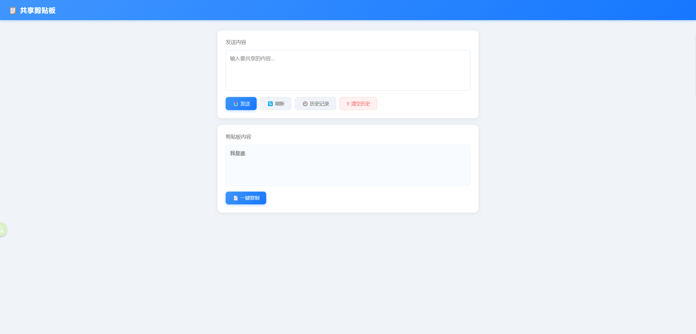

# local_clipboard
共享剪切板（局域网）

## 介绍
- 本项目是一个局域网内共享剪切板的工具，可以在局域网内的多台电脑之间共享剪切板内容。

  

## 使用
- 服务端：`python run.py`

  可在`run.py`中修改端口号，默认为`8888`；另外`index.html`中的`文件共享站地址`也可自行修改，用于跳转至[文件共享站](https://github.com/Li1Fan/local_fileshare)。

- 浏览器访问，如：`http://192.168.222.108:8888`

  输入内容，点击发送，即可在局域网内的其他电脑上（访问同样的地址），查看到内容并复制。

界面如下：

