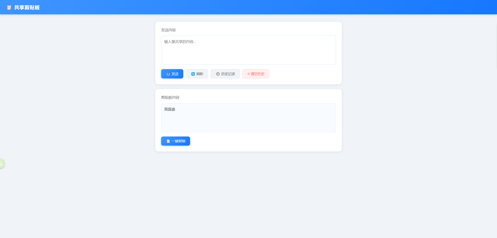

# local_clipboard
共享剪切板（局域网）


## 介绍
- 本项目是一个局域网内共享剪切板的工具，可以在局域网内的多台电脑之间共享剪切板内容。

  

## 使用

**安装依赖：**
```bash
pip install flask
```

**启动服务：**
```bash
python run.py
```

可在 `run.py` 末尾修改端口号，默认为 `8888`。

**浏览器访问：**`http://<本机IP>:8888`

输入内容点击发送，局域网内其他设备访问同一地址即可查看并一键复制。

**可选：配置文件共享站入口**

若需在导航栏显示跳转至[文件共享站](https://github.com/Li1Fan/local_fileshare)的链接，通过环境变量设置地址：

```bash
# Linux / macOS
FILESHARE_URL=http://192.168.x.x:9999 python run.py

# Windows
set FILESHARE_URL=http://192.168.x.x:9999
python run.py
```

不设置该变量时，导航栏中的文件共享站入口会自动隐藏。


界面如下：

